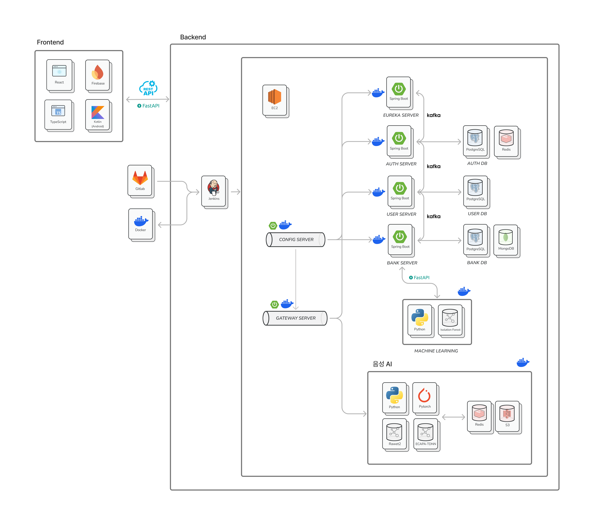
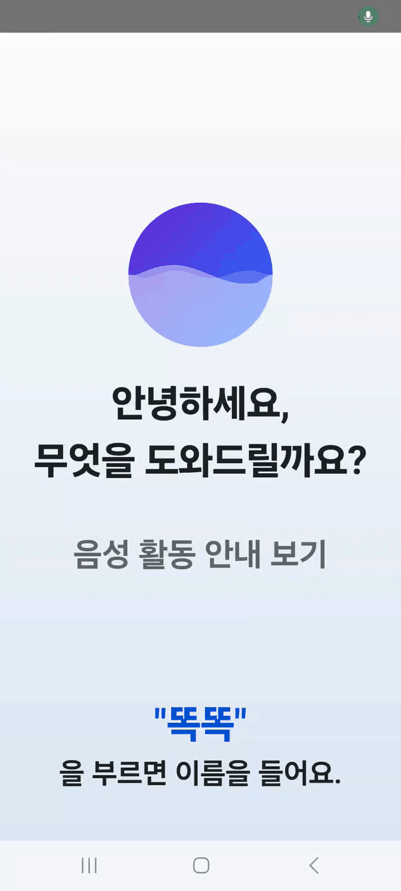

## 💡 프로젝트 소개


### ⚙ 개요

- 진행 기간 : 2025/2/27 ~ 2025/4/11
- 소개 : 음성 명령 기반 폰뱅킹 서비스

### ⚙ 기획 배경

- 최근 국내 은행들의 비대면 업무가 증가함에 따라 노년층의 디지털 소외 문제가 부각되는 현상에 주목
- 기존 은행 어플의 복잡한 UI를 개선하는 것뿐만 아니라 음성 인식을 통해 쉽게 금융 업무를 할 수 있도록 지원


### ⚙ 팀 구성

|         |  포지션   |                                                                                                          역할                                                                                                           |
|:-------:|:------:|:---------------------------------------------------------------------------------------------------------------------------------------------------------------------------------------------------------------------:|
| **박가희** | FE, 팀장 |                            계좌 생성 화면 개발 및 백엔드 API 연동,<br> 음성 시나리오 작성, <br>앱 초기 화면 백엔드 API 연동 및 분기 처리 로직 구현,<br>회원가입 및 로그인 기능 백엔드 API 연동 및 뷰모델 연계 로직 구현,<br>계좌 이체 기능 백엔드 API 연동 및 음성 시나리오 작성                            |
| **김고은** |   FE   |                                                                                          신분증 OCR, 공과금 납부, 회원가입 및 계좌이체 화면 디자인                                                                                          |
| **최은진** |   FE   |                                                                                                음성 라우팅, 계좌 목록 조회, 푸시알림                                                                                                 |
| **김성찬** |   AI   |                                                                                                 의도 추론, 화자 식별, 스푸핑 탐지                                                                                                  |
| **김시아** |   BE   |                                                                                      계좌 생성/이체/해지, 계좌 정보 조회/수정, FCM, 이상거래 탐지(ML)                                                                                       |
| **이영석** |   BE   |                                                                                Infra, CI/CD, 회원가입, 로그인, 로그아웃, 회원 관련 인증, 유저 서비스, S3 연동                                                                                 |

<br>

### ⚙ 개발 환경 및 기술


### ⚙ API 명세서

- `notion`
https://www.notion.so/Rest-API-1ac1f58b9939808c87dbd4798d9ec76d

- `postman`
https://documenter.getpostman.com/view/41511989/2sB2cYbKnX


### ⚙ ERD


### ⚙ 아키텍처




## 🆚 서비스 소개

### ⚙ 회원가입 및 로그인


- 회원가입
  - 핸드폰 인증
  - OCR 신분증 인증


- 로그인
  - JWT, Spring Security 활용


### ⚙ 계좌 생성


- "계좌 생성해줘"를 말할 경우 자동으로 인식하여 페이지 이동

### ⚙ 계좌 목록 조회


- "계좌 목록 조회해줘"를 말할 경우 자동으로 인식하여 페이지 이동


### ⚙ 계좌 이체 (본인)


- 계좌 이체 시 목소리 인증을 통해 화자 식별
- 본인이라고 판단된 경우 이체 성공


### ⚙ 계좌 이체 (타인)


- 타인이 계좌 이체를 시도할 경우 목소리 인증 실패
- 이 경우 비밀번호 인증 단계로 넘어감


### ⚙ 공과금 납부 


- OCR 인식을 통해 공과금 납부


### ⚙ FCM



- 계좌에 돈이 입금된 경우 푸시 알람 전송

---

## 🆚 Machine Learning

### ⚙ 이상거래 탐지

- `Isolation Forest` 사용
  - 이상치 탐지에 특화된 머신러닝 알고리즘의 종류
  - 비지도 학습이 가능하기 때문에 정상 거래, 비정상 거래 여부를 알 수 없는 데이터의 이상치 판단 가능


- 재학습
  - 유저들이 거래를 할 때마다 거래 내역을 MongoDB에 저장
  - 해당 거래 내역을 Spring Scheduler를 통해 매일 자정에 모델에 재학습시켜 업데이트
  - Fast API를 통해 재학습 API 호출


- 신규 유저들의 cold start 문제 방지를 위해 약 1만 건의 거래 내역 데이터를 학습하여 모델에 적용


---

## 🆚 AI

### ⚙ 의도 추론

- `KF-DeBERTa` 사용
  - 카카오뱅크 & 에프엔가이드에서 학습한 금융 도메인 특화 언어모델
  - 범용 도메인과 금융 도메인 말뭉치를 함께 학습한 언어 모델


- 금융 관련 의도(계좌해지, 송금, 공과금 납부 등)를 정확히 파악하기 위해 8개의 의도 클래스로 분류
- 각 의도 당 약 150개의 단어 및 문장을 transformers 라이브러리 기반으로 fine-tuning 하여 적용
- 의도 추론이 완료 되면 정규식 패턴 매칭과 LLM(GPT-3.5)을 조합하여 그 문장에서 엔티티 추출
- 금액 추출에는 정규식 패턴을 활용하여 다양한 표현(순수 한글, 5만원, 3억5천만원, 순수 숫자 등)을 정확히 인식하게 구현
- 수취인, 계좌 별명 등은 LLM을 활용해 맥락을 이해하고 추출
- 순수 한글 금액 표현을 처리하기 위해 `korNum` 라이브러리 사용


### ⚙ 화자 식별

- `ECAPA-TDNN` 사용
  - 화자 검증 분야에 대해 국제 벤치마크(Speaker Verification Challenge)에서 성능이 검증된 최신 구조


- `ECAPA1024` 사용
  - VoxCeleb2 데이터셋 기반으로 학습
  - 실제 서비스 음성과 유사한 발화 환경에서도 안정적인 성능 보장


- 사전학습된 모델과 Cosine 유사도 기반 검증 로직을 결합하여 로그인된 사용자와 말하는 사용자가 동일한지 확인

### ⚙ 스푸핑 탐지

- 음성 인증 시스템의 주요 취약점인 스푸핑 공격(TTS, VC, 리플레이)을 방어하기 위한 이중 보안 장치

- ASVspoof 2019 데이터셋으로 학습된 `RawNet2` 모델을 적용해 위조 여부를 판별

---

## 🆚 MSA

- MSA란?
  - 앱 내 다양한 서비스의 개발과 배포, 확장을 독립적으로 수행
  - 개발 생산성 향상에 따른 개발 기간 단축과 고객 피드백을 반영한 즉각적인 서비스 개선 가능

  
- 따라서 앱 서비스 일부 장애가 다른 서비스로 확산될 가능성이 작기 때문에 안정성과 민첩성이 뛰어나다고 판단하여 도입

### ⚙ Saga Pattern

- saga pattern이란?
  - 여러 마이크로서비스 간의 트랜잭션을 조정하여 데이터 일관성 유지에 도움이 되는 장애 관리 패턴


- MSA 기반으로 회원 서버, 인증 서버, 은행 서버를 분리했기 때문에 트랜잭션 관리 전략으로 도입

<br>

- 프로젝트 적용 사례
<br>


<br>


<br>


- 회원 가입 시 Auth 도메인에서 오류가 발생한 경우 User 도메인에 저장된 데이터를 롤백하여 데이터 정합성을 유지

<br>

### ⚙ Circuit breaker Pattern

- circuit breaker pattern이란?
  - 원격 접속의 성공 및 실패를 카운트하여 에러율(failure rate)이 임계치를 넘어섰을 때 자동적으로 접속을 차단하는 시스템

- `Resilience4j`를 통해 구현


- 프로젝트 적용 사례
  

위와 같은 에러 전파와 스레드 점유 및 대기 상황을 방지하기 위해 장애를 격리하여 관리


### ⚙ 부하 테스트 


- 위와 같은 MSA 구조 아래에서 안정성을 확인하기 위해 부하 테스트 실시

- 사용 기술 : `K6`, `influxdb`, `Grafana`


- 10분동안 500명의 가상 이용자가 약 9만번의 요청을 한다고 가정
  - 초당 처리 속도 : 140TPS
  - 평균 응답 속도 : 1.26초


---
## 📄 PR Template

```declarative
# [FE] merge: from feature/ to dev


## 🤷‍♂️ Description
<!-- 기능을 설명해주세요. -->


## 🔎 PR 유형
어떤 변경 사항이 있나요?

- [ ] 기능 및 코드 추가
- [ ] 기능 및 코드 수정 완료
- [ ] 버그 수정
- [ ] 디자인 수정
- [ ] 코드 리팩토링
- [ ] 문서작성 및 편집
- [ ] config 파일 수정
- [ ] 파일 추가
- [ ] 파일 제거
- [ ] 오타 수정
- [ ] 프로젝트 구조 변경


## 📸 Screenshots
<!-- 필요한 경우 사진을 남겨주세요. -->


## ✳️ Remarks
<!-- 비고란으로 Optional 입니다. 필요시 수정해주세요. -->


## ➕ 지라 링크
- [지라번호-숫자](지라주소)


## 🧐 PR Checklist
PR이 다음 요구 사항을 충족하는지 확인하세요.

- [ ] 커밋 메시지 & 브랜치 컨벤션에 맞게 작성했습니다.
- [ ] 변경 사항에 대한 테스트를 했습니다.(버그 수정/기능에 대한 테스트).
- [ ] 변경 사항에 대한 빌드에 성공했습니다.
```

## ⚠️ Commit Convention


| 커밋 유형 | 의미 |
| :---: | :---: |
| `feat` | 새로운 기능에 대한 커밋 |
| `fix` | 버그 수정에 대한 커밋 |
| `build` | 빌드 관련 파일 수정 / 모듈 설치 또는 삭제에 대한 커밋 |
| `chore` | 그 외 자잘한 수정에 대한 커밋 |
| `ci` | ci 관련 설정 수정에 대한 커밋 |
| `docs` | 문서 수정에 대한 커밋 |
| `style` | 코드 스타일 혹은 포맷, 단순 디자인 변경 등 |
| `refactor` | 코드 리팩토링에 대한 커밋 |
| `test` | 테스트 코드 수정에 대한 커밋 |
| `perf` | 성능 개선에 대한 커밋 |
| `add` | 파일 추가에 대한 커밋 |
| `remove` | 파일 삭제에 대한 커밋 |
